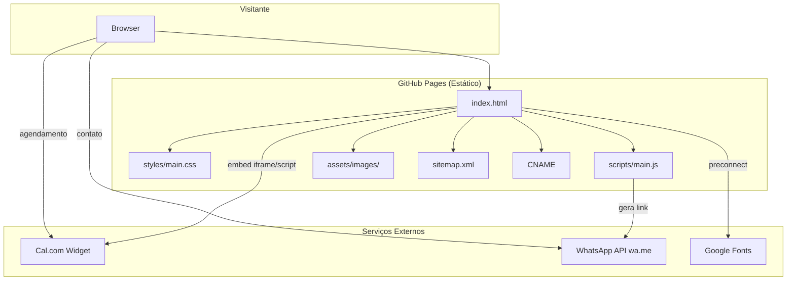

# Design Técnico — Website de Hipnoterapia

## Visão Geral

Website estático single-page para um consultório de hipnoterapia, hospedado no GitHub Pages. O site apresenta informações institucionais, integra agendamento via serviço externo (Cal.com/Calendly) e oferece contato via WhatsApp. A arquitetura é inteiramente client-side, sem dependência de servidor backend.

### Decisões Técnicas Principais

| Decisão | Escolha | Justificativa |
|---------|---------|---------------|
| Hospedagem | GitHub Pages | Requisito explícito; gratuito, confiável |
| Abordagem | HTML/CSS/JS puro | Sem build step; deploy direto; máxima compatibilidade com GitHub Pages |
| CSS | Custom Properties + Flexbox/Grid | Sem dependência de framework; controle total sobre design; performance |
| Agendamento | Cal.com (embed) | Gratuito, open-source, suporta confirmação manual, link de videochamada |
| Contato | WhatsApp API (wa.me) | Client-side; sem backend necessário |
| Ícones | SVG inline | Performance; sem dependência externa |
| Fontes | Google Fonts (preconnect) | Tipografia profissional com carregamento otimizado |

## Arquitetura

### Diagrama de Arquitetura



### Estrutura de Arquivos

```
/
├── index.html              # Página única com todas as seções
├── styles/
│   └── main.css            # Estilos com Custom Properties
├── scripts/
│   └── main.js             # Navegação, formulário, scroll
├── assets/
│   ├── images/             # Fotos e ilustrações otimizadas
│   └── icons/              # SVGs inline (se necessário separar)
├── sitemap.xml             # Mapa do site para SEO
├── robots.txt              # Configuração de crawlers
├── CNAME                   # Domínio personalizado (opcional)
├── manifest.json           # PWA metadata (opcional)
└── README.md               # Documentação de deploy
```

## Componentes e Interfaces

### 1. Estrutura HTML (index.html)

O HTML segue uma estrutura semântica com seções identificadas por IDs para navegação por âncoras:

```html
<body>
  <header id="header">         <!-- Menu fixo de navegação -->
  <main>
    <section id="hero">        <!-- Banner principal com CTA -->
    <section id="hipnoterapia"> <!-- Sobre a hipnoterapia -->
    <section id="terapeuta">   <!-- Sobre o terapeuta -->
    <section id="publico">     <!-- Público atendido -->
    <section id="agendamento"> <!-- Widget Cal.com + instruções -->
    <section id="contato">     <!-- Formulário WhatsApp -->
  </main>
  <footer>                     <!-- Informações legais e links -->
</body>
```

### 2. Componente de Navegação (Header)

**Responsabilidades:**
- Menu fixo no topo com links âncora para cada seção
- Destaque visual da seção atualmente visível (Intersection Observer)
- Menu hamburger em dispositivos móveis
- Scroll suave ao clicar nos links

**Interface:**
```javascript
// Módulo de navegação
const Navigation = {
  init()                    // Inicializa observers e event listeners
  highlightActiveSection()  // Atualiza item ativo no menu
  smoothScrollTo(sectionId) // Rola suavemente até a seção
  toggleMobileMenu()        // Abre/fecha menu mobile
}
```

### 3. Componente de Agendamento (Widget Externo)

**Responsabilidades:**
- Incorporar widget Cal.com via script embed
- Exibir instruções sobre o processo de agendamento
- Informar sobre modalidade remota

**Integração:**
```html
<!-- Cal.com Embed -->
<div id="cal-embed" 
     data-cal-link="TERAPEUTA_USERNAME"
     data-cal-config='{"layout":"month_view"}'>
</div>
<script src="https://cal.com/embed.js" async></script>
```

### 4. Componente de Formulário de Contato

**Responsabilidades:**
- Coletar nome e mensagem do visitante
- Validar campos obrigatórios (client-side)
- Gerar link WhatsApp com mensagem pré-formatada
- Redirecionar para WhatsApp

**Interface:**
```javascript
// Módulo de contato
const ContactForm = {
  init()                          // Inicializa validação e submit
  validate(formData)              // Valida campos obrigatórios
  buildWhatsAppUrl(phone, name, message) // Gera URL wa.me formatada
  submit(event)                   // Processa envio do formulário
}
```

**Lógica de geração de URL:**
```javascript
function buildWhatsAppUrl(phone, name, message) {
  const formattedMessage = `Olá! Meu nome é ${name}. ${message}`;
  const encodedMessage = encodeURIComponent(formattedMessage);
  return `https://wa.me/${phone}?text=${encodedMessage}`;
}
```

### 5. Componente de Scroll e Animações

**Responsabilidades:**
- Intersection Observer para detectar seção visível
- Animações de entrada (fade-in) ao rolar
- Botão "voltar ao topo"

**Interface:**
```javascript
// Módulo de scroll
const ScrollManager = {
  init()                    // Configura observers
  observeSections()         // Monitora visibilidade das seções
  animateOnScroll()         // Animações de entrada
  showBackToTop()           // Controla visibilidade do botão
}
```

## Modelos de Dados

### Configuração do Site (constantes em JS)

```javascript
const SITE_CONFIG = {
  therapist: {
    name: "Nome do Terapeuta",
    phone: "5511999999999",        // Número WhatsApp (com código país)
    email: "contato@exemplo.com",
    calcomUsername: "terapeuta",    // Username no Cal.com
  },
  sections: [
    { id: "hero", label: "Início" },
    { id: "hipnoterapia", label: "Hipnoterapia" },
    { id: "terapeuta", label: "Sobre Mim" },
    { id: "publico", label: "Público" },
    { id: "agendamento", label: "Agendar" },
    { id: "contato", label: "Contato" },
  ],
  seo: {
    title: "Hipnoterapia Humanista | Nome do Terapeuta",
    description: "Hipnoterapia ericksoniana com abordagem humanista...",
    keywords: ["hipnoterapia", "hipnose ericksoniana", "neurodivergentes"],
    locale: "pt_BR",
  }
};
```

### Schema.org — Dados Estruturados (JSON-LD)

```json
{
  "@context": "https://schema.org",
  "@type": ["LocalBusiness", "HealthAndBeautyBusiness"],
  "name": "Consultório de Hipnoterapia",
  "description": "Hipnoterapia ericksoniana com abordagem humanista",
  "url": "https://exemplo.com",
  "telephone": "+5511999999999",
  "address": {
    "@type": "PostalAddress",
    "addressLocality": "Cidade",
    "addressRegion": "Estado",
    "addressCountry": "BR"
  },
  "priceRange": "$$",
  "openingHours": "Mo-Fr 08:00-18:00",
  "sameAs": [],
  "makesOffer": {
    "@type": "Offer",
    "itemOffered": {
      "@type": "Service",
      "name": "Hipnoterapia",
      "description": "Sessões de hipnoterapia ericksoniana"
    }
  }
}
```

### Modelo do Formulário de Contato

```typescript
// Representação conceitual dos dados do formulário
interface ContactFormData {
  name: string;       // Obrigatório, mínimo 2 caracteres
  message: string;    // Obrigatório, mínimo 10 caracteres
}

interface WhatsAppLink {
  baseUrl: "https://wa.me/";
  phone: string;      // Número sem formatação, com código país
  text: string;       // Mensagem URL-encoded
}
```


## Propriedades de Corretude

*Uma propriedade é uma característica ou comportamento que deve ser verdadeiro em todas as execuções válidas de um sistema — essencialmente, uma declaração formal sobre o que o sistema deve fazer. Propriedades servem como ponte entre especificações legíveis por humanos e garantias de corretude verificáveis por máquina.*

### Property 1: Round-trip da URL do WhatsApp

*Para qualquer* nome válido (não-vazio) e mensagem válida (não-vazia), ao construir a URL do WhatsApp via `buildWhatsAppUrl(phone, name, message)` e depois decodificar o parâmetro `text` da URL resultante, o texto decodificado DEVE conter tanto o nome quanto a mensagem originais.

**Validates: Requirements 8.2, 8.3**

### Property 2: Rejeição de mensagem vazia/whitespace

*Para qualquer* string composta exclusivamente por caracteres de espaço em branco (espaços, tabs, quebras de linha), a função de validação do formulário DEVE rejeitar a submissão e retornar um erro de validação, mantendo o estado do formulário inalterado.

**Validates: Requirements 8.4**

## Tratamento de Erros

### Formulário de Contato
| Cenário | Comportamento |
|---------|---------------|
| Nome vazio | Exibe mensagem de validação; impede submissão |
| Mensagem vazia/whitespace | Exibe mensagem de validação; impede submissão |
| Caracteres especiais no nome/mensagem | Codifica corretamente via `encodeURIComponent` |
| WhatsApp não instalado no dispositivo | Abre WhatsApp Web como fallback (comportamento nativo do wa.me) |

### Widget de Agendamento (Cal.com)
| Cenário | Comportamento |
|---------|---------------|
| Script Cal.com falha ao carregar | Exibe mensagem alternativa com link direto para a página do Cal.com |
| Conexão lenta | Widget carrega de forma assíncrona; conteúdo da página permanece acessível |

### Navegação
| Cenário | Comportamento |
|---------|---------------|
| JavaScript desabilitado | Links âncora funcionam nativamente (sem smooth scroll); conteúdo permanece acessível |
| Seção não encontrada | Link âncora não faz nada (comportamento padrão do browser) |

### Acessibilidade
| Cenário | Comportamento |
|---------|---------------|
| Leitor de tela | Landmarks ARIA, alt text em imagens, labels em formulários |
| Navegação por teclado | Focus visible em todos os elementos interativos; skip-to-content link |
| Preferência de movimento reduzido | `prefers-reduced-motion` desabilita animações de scroll |

## Estratégia de Testes

### Abordagem Geral

Dado que este é um site estático com lógica JavaScript mínima, a estratégia de testes combina:

1. **Testes unitários** — para a lógica JavaScript (geração de URL, validação)
2. **Testes de propriedade (PBT)** — para a função `buildWhatsAppUrl` e validação de formulário
3. **Testes de acessibilidade automatizados** — via axe-core
4. **Testes de performance** — via Lighthouse CI
5. **Validação de HTML/SEO** — via ferramentas de linting

### Testes de Propriedade (Property-Based Testing)

**Biblioteca:** [fast-check](https://github.com/dubzzz/fast-check) (JavaScript)

**Configuração:** Mínimo 100 iterações por teste de propriedade.

**Propriedades a testar:**

1. **Feature: therapy-website, Property 1: WhatsApp URL round-trip**
   - Gerar nomes e mensagens aleatórios (strings não-vazias com caracteres variados incluindo acentos, emojis, caracteres especiais)
   - Verificar que `decodeURIComponent` do parâmetro `text` da URL gerada contém o nome e a mensagem
   - Verificar que a URL começa com `https://wa.me/` seguido do número de telefone

2. **Feature: therapy-website, Property 2: Empty message rejection**
   - Gerar strings compostas apenas de whitespace (espaços, tabs, `\n`, `\r`)
   - Verificar que a função de validação retorna `false` / erro para todas elas

### Testes Unitários (Exemplos)

- Navegação: verificar que todos os links do menu apontam para IDs existentes
- SEO: verificar presença de meta tags obrigatórias
- Schema.org: validar estrutura JSON-LD
- Responsividade: verificar media queries nos breakpoints definidos
- Acessibilidade: verificar atributos ARIA, alt texts, labels

### Testes de Integração

- Widget Cal.com: verificar que o script embed carrega corretamente
- Performance: Lighthouse score ≥ 90 em Performance, Accessibility, SEO
- HTML válido: W3C validator sem erros

### Ferramentas

| Ferramenta | Propósito |
|-----------|-----------|
| fast-check | Testes de propriedade para lógica JS |
| Vitest | Runner de testes unitários |
| axe-core | Testes de acessibilidade automatizados |
| Lighthouse CI | Performance e SEO |
| html-validate | Validação de HTML semântico |
